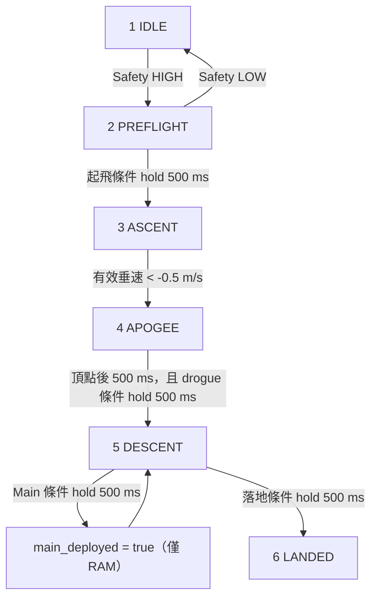

# Rocket Main

ESP32-S3 飛行電腦韌體。此程式負責讀取 GPS、慣性、環境、RTC、電池與落水訊號，執行飛行狀態判斷，將固定 47-byte 遙測封包送往 UART0 與 LoRa，並把較完整的資料追加寫入 microSD。

本文以目前的 [`src/main.cpp`](src/main.cpp)、[`include/error_codes.h`](include/error_codes.h) 與 [`platformio.ini`](platformio.ini) 為準。若文件與程式不一致，以上述原始碼和設定檔為最終依據。

> [!WARNING]
> 目前程式尚未驅動分離伺服或兩路相機觸發：GPIO 16、5、6 到 `setup()` 執行後才設為 output LOW，之後不再改變；reset/ROM boot 到此之前通常仍是 input/high-impedance。`main_deployed` 也只是內部旗標，沒有任何實體部署輸出。安全預設必須由外部 pull-down／硬體互鎖保證，請勿把目前狀態機視為已完成的回收／分離控制器。

> [!CAUTION]
> `SAFETY_SWITCH_PIN` 使用 `INPUT_PULLUP`，而程式把 **HIGH 視為 armed**；因此開路、接頭脫落或未接線也會進入 `PREFLIGHT`。在任何帶動力或部署機構的測試前，必須先確認實際安全迴路、輸出極性與失效模式。

## 目錄

- [目前功能與未完成項目](#目前功能與未完成項目)
- [專案結構](#專案結構)
- [快速開始](#快速開始)
- [PlatformIO 建置設定](#platformio-建置設定)
- [硬體接線與匯流排](#硬體接線與匯流排)
- [全部可調參數](#全部可調參數)
- [程式架構與資料流程](#程式架構與資料流程)
- [感測器、座標系與濾波](#感測器座標系與濾波)
- [飛行狀態機](#飛行狀態機)
- [UART、RTC 指令與開機診斷](#uartrtc-指令與開機診斷)
- [47-byte 遙測協定](#47-byte-遙測協定)
- [LoRa 傳輸](#lora-傳輸)
- [microSD 記錄格式](#microsd-記錄格式)
- [錯誤碼與復原策略](#錯誤碼與復原策略)
- [已知限制與風險](#已知限制與風險)
- [修改設定時的同步清單](#修改設定時的同步清單)
- [驗證狀態](#驗證狀態)
- [相關專案](#相關專案)

## 目前功能與未完成項目

### 已實作

- GPS UART1 NMEA 接收、checksum 驗證、RMC/GGA 解析與自動 baud rate 輪詢。
- ICM42688 gyro/accelerometer 讀取與 Madgwick IMU 姿態融合。
- ADXL375 高 G 三軸加速度讀取。
- SHT31 溫濕度讀取。
- DS3231 RTC、1 Hz SQW 設定及 UART 時間同步。
- 電池 ADC 與 200 kΩ / 100 kΩ 分壓換算。
- 兩條 I2C bus 的時脈降級、bus recovery、裝置探測與 motion sensor 重試。
- 47-byte little-endian 遙測封包、XOR checksum、UART0 與 LoRa 同步輸出。
- `/telemetry.csv` microSD 追加記錄。
- IDLE → PREFLIGHT → ASCENT → APOGEE → DESCENT → LANDED 狀態判斷。
- WS2812 狀態顏色、LoRa/SD/RTC/IMU/ADXL/GPS/電池錯誤 bitmask。

### 預設停用

- `kEnableBmp390 = false`：BMP3XX 不初始化，氣壓、氣壓高度皆不讀取。
- `kEnableStartupTone = false`：開機音階不播放。
- `kEnableBackupHeartbeat = false`：UART2 備援板心跳不啟用。
- `kBatteryLowMv = 0`：低電壓門檻停用，只把 ADC 讀值為 0 視為電池錯誤。

### 尚未實作或未接入

- 分離伺服 PWM／角度控制、drogue/main 實體部署。
- Camera A/B trigger pulse。
- 伺服電源量測與伺服角度回授；遙測值目前固定為 0。
- GPS PPS 與 GPS UTC 時間同步。
- DS3231 SQW 輸入的實際使用。
- LoRa RX、地面命令、ACK、封包重送、加密與 sequence number。
- TEST、ABORT 狀態的進入路徑。
- 飛行中由 safety switch 強制返回安全狀態。
- 應用層 watchdog／timeout recovery、自訂 ISR、額外 FreeRTOS task 或非阻塞式排程。
- `rocket_main` 內的自動化單元測試。

## 專案結構

```text
rocket_main/
├── include/
│   └── error_codes.h       # 遙測 error_code bitmask
├── src/
│   └── main.cpp            # 全部韌體邏輯
├── platformio.ini          # 板型、Flash、build flags、library 依賴
├── .gitignore              # PlatformIO / VS Code 生成檔排除規則
├── .vscode/                # IDE 設定；extensions.json 可攜，其餘多為生成檔
└── .pio/                   # 建置與套件快取，不是程式來源
```

`.vscode/c_cpp_properties.json`、`.vscode/launch.json` 與 `.pio/` 內容由 PlatformIO 產生，包含本機絕對路徑，不應手動當作可攜式設定來源。

目前 `.gitignore` 排除：

```gitignore
.pio
.vscode/.browse.c_cpp.db*
.vscode/c_cpp_properties.json
.vscode/launch.json
.vscode/ipch
```

`.vscode/extensions.json` 沒有被排除，適合保留跨開發機的 extension 建議；`.DS_Store` 目前也沒有排除規則。Repository 中已有約 391 個歷史 `.pio` 檔案被 Git 追蹤，新增 ignore 規則不會自動把既有 tracked files 移出 index。

## 快速開始

### 需求

- 本次已驗證 PlatformIO Core 6.1.19；目前解析到的 Espressif32 platform 7.0.1 要求 PlatformIO Core 6。其他組合尚未驗證。
- 或使用已安裝 PlatformIO IDE extension 的 VS Code。
- ESP32-S3 開發板／自製飛行電腦。
- 可存取 UART0 的 USB-UART 介面；USB CDC 在本專案被強制關閉。
- 燒錄前確認實體 Flash 確實是 16 MB，並先閱讀下方的 [N16R8 與 GPIO 衝突](#n16r8flashpsram-與-gpio-重要檢查)。

### 命令列

從 repository 根目錄執行：

```bash
cd rocket_main

# 編譯
pio run -e esp32-s3-devkitc-1-n16r8

# 燒錄；PlatformIO 自動偵測 upload port
pio run -e esp32-s3-devkitc-1-n16r8 -t upload

# 若自動偵測失敗，可明確指定，例如：
pio run -e esp32-s3-devkitc-1-n16r8 -t upload --upload-port /dev/cu.usbserial-XXXX

# 115200 baud UART monitor
pio device monitor -e esp32-s3-devkitc-1-n16r8

# 清除建置產物
pio run -e esp32-s3-devkitc-1-n16r8 -t clean
```

UART0 的主要輸出是 binary frame，直接用文字 monitor 看到亂碼屬正常現象。正式顯示請搭配 [`../ground_station`](../ground_station/)；地面站直接接 UART0 時選擇 115200 baud。

### VS Code

`.vscode/extensions.json`：

- 推薦 `platformio.platformio-ide`。
- 不推薦 `ms-vscode.cpptools-extension-pack`，避免與 PlatformIO 的 C/C++ 設定互相干擾。

自動產生的 `launch.json` 包含一般 Pre-Debug、跳過 Pre-Debug、以及不 upload 的三種啟動方式，但本專案未指定 `debug_tool` 或外接探針，因此不保證開箱即可硬體除錯。

## PlatformIO 建置設定

### Environment

| 項目 | 目前值 | 說明 |
| --- | --- | --- |
| Environment | `esp32-s3-devkitc-1-n16r8` | 名稱本身不會啟用 N16R8 或 PSRAM |
| Platform | `espressif32` | **未鎖版本** |
| Board | `esp32-s3-devkitc-1` | PlatformIO generic DevKitC-1 board manifest |
| Framework | `arduino` | Arduino-ESP32 |
| Flash mode | `qio` | Quad I/O |
| Flash size | `16MB` | 覆寫 board manifest 的 8 MB 預設值 |
| Partition table | `default_16MB.csv` | 兩個 OTA app 分割區 |
| Upload speed | `460800` | 未指定 upload port/protocol |
| Monitor speed | `115200` | 未指定 monitor port/filter |

`platform = espressif32` 與各 library 的 `^` 約束都不是 exact pin；另一台電腦重新解析時可能取得不同版本。若要可重現建置，應另外鎖定 platform 與各 dependency 的精確版本。

### Build flags

| Flag | 值 | 效果 |
| --- | ---: | --- |
| `ARDUINO_USB_MODE` | `1` | 使用 ESP32-S3 USB mode 1 的核心設定 |
| `ARDUINO_USB_CDC_ON_BOOT` | `0` | 關閉 boot-time USB CDC；程式若發現非 0 會直接編譯失敗 |
| `ARDUINO_USB_MSC_ON_BOOT` | `0` | 關閉 USB mass storage |
| `ARDUINO_USB_DFU_ON_BOOT` | `0` | 關閉 USB DFU |
| `CORE_DEBUG_LEVEL` | `0` | 關閉 Arduino core debug log |
| `ARDUINO_RUNNING_CORE` | `1` | Arduino `loopTask` 放在 core 1 |
| `ARDUINO_EVENT_RUNNING_CORE` | `1` | Arduino event task 放在 core 1 |

`build_unflags` 另移除 framework 可能帶入的 `-DARDUINO_USB_CDC_ON_BOOT=1`。韌體把 `Serial` 當作 UART0 地面站 port，而不是 USB CDC。

### Library 依賴

| Library | `platformio.ini` 約束 | 本次驗證機解析版本 |
| --- | ---: | ---: |
| Adafruit SHT31 Library | `^2.2.2` | 2.2.2 |
| Adafruit BMP3XX Library | `^2.1.2` | 2.1.6 |
| Adafruit ADXL375 | `^1.1.2` | 1.1.2 |
| finani/ICM42688 | `^1.1.0` | 1.1.0 |
| Adafruit Unified Sensor | `^1.1.14` | 1.1.15 |
| Adafruit BusIO | `^1.14.5` | 1.17.4 |
| RTClib | `^2.1.4` | 2.1.4 |
| Adafruit NeoPixel | `^1.12.0` | 1.15.4 |
| sandeepmistry/LoRa | `^0.8.0` | 0.8.0 |

Arduino framework 內建的 `Wire`、`SPI`、`SD` 與 `FS` 也會被使用。ADXL375 另解析出遞移依賴 Adafruit ADXL343。

本次成功編譯時的環境快照：

- PlatformIO Core 6.1.19。
- Espressif32 platform 7.0.1。
- Arduino-ESP32 package `3.20017.241212+sha.dcc1105b`，對應 Arduino core 2.0.17。
- 由自動產生的 IntelliSense 設定觀察到 ESP-IDF v4.4.7、C `gnu99`、C++ `gnu++11`；並非 `platformio.ini` 明確鎖定。
- Xtensa ESP32-S3 toolchain `8.4.0+2021r2-patch5`。

這些是驗證快照，不是 repository 已鎖定的保證版本；編譯結果與容量見 [驗證狀態](#驗證狀態)。

下文提到的 generic board manifest、UART0 variant pins、SPI 預設頻率，以及 ICM/SHT/LoRa library 內部行為，都以這組解析版本為觀察基準；升級 platform 或 library 後必須重新核對。

### `default_16MB.csv` 分割表

目前 Arduino-ESP32 2.0.17 套件內的表格為：

| 名稱 | Offset | Size | 用途 |
| --- | ---: | ---: | --- |
| `nvs` | `0x9000` | `0x5000`（20 KiB） | NVS |
| `otadata` | `0xE000` | `0x2000`（8 KiB） | OTA 選擇資料 |
| `app0` | `0x10000` | `0x640000`（6.25 MiB） | OTA app 0 |
| `app1` | `0x650000` | `0x640000`（6.25 MiB） | OTA app 1 |
| `spiffs` | `0xC90000` | `0x360000`（3.375 MiB） | SPIFFS |
| `coredump` | `0xFF0000` | `0x10000`（64 KiB） | Core dump |

程式目前沒有 OTA、SPIFFS 或 NVS 應用邏輯；microSD 使用的是外接 SD card，不是這個 SPIFFS partition。

### N16R8、Flash/PSRAM 與 GPIO 重要檢查

`esp32-s3-devkitc-1-n16r8` 只是 environment 名稱。目前設定只把 Flash 改成 16 MB/QIO 和 16 MB partition，沒有 `board_build.arduino.memory_type`、PSRAM type 或 `BOARD_HAS_PSRAM`，所以 **8 MB PSRAM 並未啟用或驗證**。PlatformIO 的 board manifest 仍是「ESP32-S3-DevKitC-1-N8，8 MB Flash、No PSRAM」基底。

如果實機是使用 Octal PSRAM 的 ESP32-S3R8／R8V 或 N16R8 模組，GPIO33–37 會連到 SPIIO4–SPIIO7/SPIDQS；目前程式卻使用：

- GPIO35：GPS TX。
- GPIO36：LoRa DIO1。
- GPIO37：LoRa DIO0。

這三個訊號可能與 PSRAM 實體線路直接衝突。啟用 PSRAM 前必須依實際 module datasheet/原理圖重新配置腳位。另有以下複用限制：

- GPIO19/20 是原生 USB D-/D+／USB Serial-JTAG pins；本專案把它們改作 I2C_A，原生 USB 功能會受影響。
- GPIO39–42 是外部 JTAG MTCK/MTDO/MTDI/MTMS pins；本專案把它們用作 LoRa SPI，無法同時依預設腳位使用外部 JTAG。
- GPIO3 是 JTAG source selection 相關 strapping pin；外部 RTC SQW 線路及其外接 pull-up 會參與 reset 取樣。韌體到 `setup()` 才啟用的內部 `INPUT_PULLUP` 不會改變上電瞬間的 strap sample。
- GPIO45 是 VDD_SPI voltage strapping pin；外接 GPS TX 會參與 reset 取樣。實際效果也取決於 module 與 eFuse 設定。

ESP32-S3 腳位限制可對照 Espressif 官方的 [GPIO 說明](https://docs.espressif.com/projects/esp-idf/en/latest/esp32s3/api-reference/peripherals/gpio.html) 與 [JTAG 腳位說明](https://docs.espressif.com/projects/esp-idf/en/latest/esp32s3/api-guides/jtag-debugging/configure-other-jtag.html)。

## 硬體接線與匯流排

### 完整 pin map

下表的 TX/RX 都以 **ESP32-S3 端** 為視角。

| GPIO | 定義 | 方向／介面 | 開機設定與用途 |
| ---: | --- | --- | --- |
| 3 | `DS3231_SQW_PIN` | Input, pull-up | DS3231 1 Hz SQW；目前未讀取；strapping pin |
| 4 | `BATTERY_ADC_PIN` | ADC input | 12-bit、11 dB attenuation；讀取 1/3 分壓 |
| 5 | `CAMERA_A_TRIGGER_PIN` | Output | `setup()` 後驅動 LOW；之前需外部安全偏壓；之後未改變 |
| 6 | `CAMERA_B_TRIGGER_PIN` | Output | `setup()` 後驅動 LOW；之前需外部安全偏壓；之後未改變 |
| 8 | `BUZZER_PIN` | LEDC output | Channel 0 tone |
| 9 | `I2C_B_SDA` | I2C `Wire1` | SHT31／DS3231，目標 100 kHz |
| 10 | `I2C_B_SCL` | I2C `Wire1` | SHT31／DS3231，目標 100 kHz |
| 11 | `SD_CS` | SPI CS | microSD |
| 12 | `SD_MOSI` | SPI MOSI | microSD |
| 13 | `SD_SCK` | SPI SCK | microSD |
| 14 | `SD_MISO` | SPI MISO | microSD |
| 15 | `WATER_DETECT_PIN` | Plain input | HIGH = water；無內部 pull-up/down |
| 16 | `SEPARATION_SERVO_PIN` | Output | `setup()` 後驅動 LOW；之前需外部安全偏壓；沒有 PWM 或部署輸出 |
| 17 | `UART_SUB_TX` | UART2 TX | 備援板 RX；功能預設停用 |
| 18 | `UART_SUB_RX` | UART2 RX | 備援板 TX；功能預設停用 |
| 19 | `I2C_A_SCL` | I2C `Wire` | Motion/BMP；同時是 native USB D- |
| 20 | `I2C_A_SDA` | I2C `Wire` | Motion/BMP；同時是 native USB D+ |
| 21 | `SAFETY_SWITCH_PIN` | Input, pull-up | **HIGH = armed，LOW = disarmed** |
| 35 | `UART_GPS_TX` | UART1 TX | 接 GPS RX；Octal PSRAM 衝突風險 |
| 36 | `LORA_DIO1` | Input | 只設 input，LoRa library 未使用；Octal PSRAM 衝突風險 |
| 37 | `LORA_DIO0` | Input | 交給 `LoRa.setPins`；目前 blocking TX 輪詢 register、沒有 GPIO ISR；Octal PSRAM 衝突風險 |
| 38 | `LORA_RST` | Output | LoRa reset |
| 39 | `LORA_NSS` | SPI CS | LoRa；同時是 MTCK |
| 40 | `LORA_MOSI` | SPI MOSI | LoRa；同時是 MTDO |
| 41 | `LORA_MISO` | SPI MISO | LoRa；同時是 MTDI |
| 42 | `LORA_SCK` | SPI SCK | LoRa；同時是 MTMS |
| 45 | `UART_GPS_RX` | UART1 RX | 接 GPS TX；strapping pin |
| 47 | `UART_GPS_PPS` | Input | GPS PPS；目前未讀取 |
| 48 | `WS2812_PIN` | One-wire output | 1 顆 GRB/800 kHz status LED |

UART0 `Serial` 沒有在程式內指定腳位；目前 generic ESP32-S3 variant 的預設是 TX GPIO43、RX GPIO44。若更換 board variant，請以該 variant 的 `pins_arduino.h` 為準。

### I2C 裝置與位址

| 裝置 | 預期 bus | 位址／搜尋順序 | 目前狀態 |
| --- | --- | --- | --- |
| SHT31 | I2C_B / `Wire1` | 固定 `0x44` | 啟用；只進 SD CSV |
| DS3231 | I2C_B / `Wire1` | `0x68` | 啟用；RTC Unix time 只進 SD CSV |
| BMP3XX | I2C_A / `Wire` | library 預設 `0x77` | `kEnableBmp390=false`，預設停用 |
| ADXL375 | 自動 | A:`0x53` → A:`0x1D` → B:`0x53` → B:`0x1D` | 啟用，找不到時永久重試 |
| ICM42688 | 自動 | A:`0x68` → A:`0x69` → B:`0x68` → B:`0x69` | 啟用，找不到時永久重試 |

建議把 ICM42688 放在 I2C_A。DS3231 已在 I2C_B 使用 `0x68`；它會被 ICM 自動探測誤認為 B:`0x68` 候選，導致真正位於 B:`0x69` 的 ICM 不再被嘗試。兩顆真正在同一 bus 使用相同位址時也無法共存。

兩條 I2C bus 的初始化流程：

1. 依序用 100 kHz、50 kHz、25 kHz 探測已知位址。
2. 若完全沒有回應，最多產生 18 個 SCL pulse，再送出類 STOP 的 recovery 波形。
3. 再次嘗試三個時脈。
4. 找到裝置後保留成功的時脈；完全找不到則回到 100 kHz。
5. 每次 transaction timeout 設為 20 ms。
6. ADXL 或 ICM 尚未 ready 時，每 1 秒重建 **兩條** bus 並重試；`kSensorRetryWindowMs=0` 代表永不停止。

`DEBUG_SERIAL=0` 時為縮短 boot，內部 `known_addrs` 只列出 `0x44, 0x76, 0x77, 0x53, 0x1D, 0x68, 0x69`；設為 1 時才完整掃描 `0x03`–`0x77`。

目前 ICM42688 library 在 `begin()` 內會把所用 I2C bus 改到 400 kHz；application 初始化完成後會把 `Wire`、`Wire1` 都恢復為前述各自探測成功的 runtime clock。

### SPI

| 子系統 | SPI instance | Pins | 其他 |
| --- | --- | --- | --- |
| LoRa | `SPIClass(HSPI)` | SCK42 / MISO41 / MOSI40 / CS39 | LoRa library 預設 SPI 8 MHz |
| microSD | `VSPI`（若存在）否則 `FSPI` | SCK13 / MISO14 / MOSI12 / CS11 | `SD.begin` 未指定頻率；目前 Arduino core 預設 4 MHz |

兩個子系統使用不同 `SPIClass` instance 與獨立 CS。

### UART

| Port | Baud / format | Pins | 用途 |
| --- | --- | --- | --- |
| UART0 `Serial` | 115200, 8N1 | variant 預設 TX43/RX44 | 47-byte frame、BOOT/HB 診斷、接收 `RTC_SYNC` |
| UART1 `GPSSerial` | 初始 230400, 8N1 | TX35/RX45 | GPS NMEA |
| UART2 `BackupSerial` | 115200, 8N1 | TX17/RX18 | 預設停用；100 ms 只是最小門檻，實際每輪最多一包 |

## 全部可調參數

除 `platformio.ini` 外，大多數可調值目前直接宣告在 `src/main.cpp`，沒有 runtime 設定檔、NVS 或地面站參數下傳機制。修改後必須重新編譯與燒錄。

### 功能開關

| 常數／macro | 預設值 | 效果 |
| --- | ---: | --- |
| `DEBUG_SERIAL` | `0` | 設為 1 會把 debug ASCII 混入 UART0 binary stream |
| `kEnableBmp390` | `false` | 是否初始化並讀取 BMP3XX |
| `kEnableStartupTone` | `false` | 是否在 boot init 完成後播放音階 |
| `kEnableBackupHeartbeat` | `false` | 是否啟用 UART2 heartbeat；100 ms 最小門檻，實際週期受 loop 限制 |
| `kEnableSetupAsciiDiagnostics` | `true` | 是否輸出 `BOOT:...` 診斷；不控制兩次固定 `HB\n` |
| `kBatteryLowMv` | `0` | 0 = 關閉低電壓門檻；ADC=0 仍算錯誤 |
| `kSensorRetryWindowMs` | `0` | 0 = ADXL/ICM 永久重試 |

`DEBUG_SERIAL=0` 時，`DBG_PRINTF` 與 `DBG_PRINTLN` macros 會編譯成 no-op；它不會關閉另外由 `emit_setup_diag` 或直接 `Serial.print` 產生的 BOOT/HB 文字。

### 通訊與重試

| 常數 | 值 | 單位／用途 |
| --- | ---: | --- |
| `kGroundStationBaud` | 115200 | UART0 baud |
| `UART_GPS_BAUD` | 230400 | GPS 初始 baud |
| `kGpsBaudCandidates` | 230400, 115200, 57600, 38400, 9600 | 輪詢順序 |
| `kGpsBaudCandidateCount` | 5 | 由上述陣列大小自動計算 |
| `kGpsBaudRotateIntervalMs` | 4000 | Intended sentence 切換間隔；受下述 timestamp underflow bug 影響 |
| `kGpsTimeoutMs` | 2000 | Intended fix timeout；受下述 timestamp underflow bug 影響 |
| `kGpsSentenceTimeoutMs` | 3000 | Intended course timeout；受下述 timestamp underflow bug 影響 |
| `kGpsCourseMinSpeedDms` | 20 | 2.0 m/s；GPS course fallback 最低速度 |
| `kRtcSyncLineLen` | 64 | UART0 ASCII input buffer，含結尾空字元 |
| `UART_SUB_BAUD` | 115200 | UART2 baud |
| Backup heartbeat minimum gate | 100 | ms；每輪只檢查一次，正常約 2 Hz loop 時實際約每 0.5 秒一包 |
| `kLoraRetryIntervalMs` | 2000 | LoRa 未 ready 時的重啟間隔 |
| `kLoraTxFailReinitThreshold` | 3 | 連續 API-level TX 失敗次數 |
| `kDeferredInitStepGapMs` | 5 | 相鄰 boot init stage 的最小間距 |
| `kSensorRetryIntervalMs` | 1000 | ADXL/ICM 重試間隔 |

### LoRa PHY

| 常數 | 程式設定 | 實際意義 |
| --- | ---: | --- |
| `LORA_FREQ` | 433000000 | 433 MHz |
| `LORA_SYNC_WORD` | `0x12` | Sync word |
| `LORA_TX_POWER` | 22 | 傳給 PA_BOOST；目前 LoRa 0.8.0 最終設定為 20 dBm request，非實測 RF output/EIRP |
| `LORA_BW` | 125E3 | 125 kHz bandwidth |
| `LORA_SF` | 9 | Spreading factor 9 |
| `LORA_CR` | 6 | Coding rate 4/6 |
| `LORA_PREAMBLE_LEN` | 8 | 8 symbols |
| Payload CRC | enabled | SX127x PHY CRC |
| IQ inversion | disabled | Normal IQ |
| Header mode | explicit/default | 程式未啟用 implicit header |

### I2C、ADC、感測器與濾波

| 參數 | 值 | 說明 |
| --- | ---: | --- |
| `kI2cClockHz` | 100000 Hz | 首選時脈 |
| `kI2cClockFallbackHz1` | 50000 Hz | 第一 fallback |
| `kI2cClockFallbackHz2` | 25000 Hz | 第二 fallback |
| `kI2cTimeoutMs` | 20 ms | `TwoWire` timeout |
| I2C recovery clocks | 最多 18 | SDA 卡 LOW 時 |
| Recovery half-period | 5 µs | SCL LOW/HIGH 各 5 µs |
| `kAdxlAltAddress` | `0x1D` | ADXL alternate address；default 為 `0x53` |
| ICM accelerometer full scale | ±16 g | `ICM42688::gpm16` |
| ICM gyro full scale | ±2000 °/s | `ICM42688::dps2000` |
| `kG` | 9.80665 m/s² | ADXL m/s² 轉 g |
| Madgwick `beta` | 0.15 | IMU correction gain |
| Roll/Pitch LPF `smooth_alpha` | 0.2 | 每輪一階低通 |
| Vertical-speed LPF `vs_alpha` | 0.2 | 高度差分後一階低通 |
| Yaw lock threshold | 80° | `abs(pitch) >= 80°` 時保持舊 yaw |
| Fusion `dt` | `0 < dt < 1 s` | 不在範圍就跳過該次積分 |
| Vertical-speed `dt` | `0.01 < dt < 1 s` | 不在範圍就不更新垂速 |
| Altitude stale timeout | 1000 ms | 超時後垂速失效 |
| BMP sea-level pressure | 1013.25 hPa | `readAltitude()` reference |
| BMP temperature oversampling | 8× | BMP 啟用時 |
| BMP pressure oversampling | 4× | BMP 啟用時 |
| BMP IIR coefficient | 3 | BMP 啟用時 |
| BMP output data rate | 50 Hz | BMP 啟用時 |
| ADC resolution | 12 bit | Battery ADC |
| ADC attenuation | 11 dB | Battery ADC |
| `kBatteryRTop` | 200 kΩ | 電池端至 ADC |
| `kBatteryRBottom` | 100 kΩ | ADC 至 GND |
| `kBatteryDivider` | 1/3 | `Vadc = Vbattery / 3` |

前三個 I2C clock 常數會組成內部 `kI2cClockCandidates` 陣列。

ADXL375 與 ICM42688 都沒有在 application code 顯式設定 ODR；使用 library/device 初始化後的值。SHT31 也沒有設定 heater 或額外 repeatability mode。

目前解析的 ICM42688 1.1.0 library，其 `begin()` 會用 1000 筆樣本做 gyro bias calibration，每筆至少 delay 1 ms。開機的 Motion stage 因此會阻塞約 1 秒以上，且板子在 `BOOT_INIT_DONE` 前應保持靜止。

### 飛行狀態門檻

| 常數 | 值 | 比較方式 |
| --- | ---: | --- |
| `kLiftoffAccelG` | 3.0 g | ADXL 三軸 magnitude `>` |
| `kLiftoffVSpeedMs` | 10.0 m/s | 垂直速度 `>` |
| `kLiftoffHoldMs` | 500 ms | 起飛 OR 條件持續時間 |
| `kApogeeDetectVSpeedMs` | -0.5 m/s | 上升中垂直速度 `<`，無 hold |
| `kAfterApogeeMs` | 500 ms | 頂點後最短等待 |
| `kDrogueAltMinM` | 3000 m AGL | 相對高度 `>` |
| `kDrogueVSpeedMaxMs` | 5.0 m/s | **有宣告但未使用** |
| `kDrogueTimeS` | 25 s | Liftoff 後時間 `>` |
| `kDrogueHoldMs` | 500 ms | Drogue 邏輯條件 hold |
| `kMainAltMaxM` | 500 m AGL | 相對高度 `<` |
| `kMainVSpeedMaxMs` | 5.0 m/s | Signed 垂直速度 `< +5`，不是絕對值 |
| `kMainTimeS` | 190 s | Liftoff 後時間 `>` |
| `kMainHoldMs` | 500 ms | Main 邏輯條件 hold |
| `kLandingAltMaxM` | 30 m AGL | 相對高度 `<` |
| `kLandingVSpeedMaxMs` | 5.0 m/s | `abs(vspeed) < 5` |
| `kLandingHoldMs` | 500 ms | 落地條件 hold |

### LED 與 buzzer

`WS2812_COUNT=1`，格式為 GRB/800 kHz，亮度固定 32/255。

| State | ID | RGB |
| --- | ---: | --- |
| TEST | 0 | `(255, 255, 255)` 白 |
| IDLE | 1 | `(0, 0, 255)` 藍 |
| PREFLIGHT | 2 | `(0, 255, 255)` 青 |
| ASCENT | 3 | `(0, 255, 0)` 綠 |
| APOGEE | 4 | `(255, 200, 0)` 黃橙 |
| DESCENT | 5 | `(255, 80, 0)` 橙 |
| LANDED | 6 | `(120, 60, 0)` 棕 |
| ABORT | 99 | `(255, 0, 0)` 紅 |
| Unknown | 其他 | `(32, 32, 32)` 灰 |

Buzzer 使用 `BUZZER_CH=0`、`BUZZER_RES=10` bit，`ledcSetup` 初始頻率 2000 Hz。音符常數為 `NOTE_DO=262`、`NOTE_RE=294`、`NOTE_MI=330`、`NOTE_SOL=392`、`NOTE_HDO=523` Hz；`NOTE_RE` 目前未使用。若啟用 startup tone，boot init 完成後等待 1 秒，再播放 262/330/392/523 Hz，各 120 ms，音符間隔 20 ms。

## 程式架構與資料流程

程式採 Arduino 單一 `setup()`／`loop()` 架構：

- 沒有額外 FreeRTOS task、queue、semaphore 或 software timer。
- 沒有自訂 ISR 或 `attachInterrupt()`。
- 感測器讀取、姿態融合、狀態判斷、LoRa、SD 與 UART 全部依序執行。
- `platformio.ini` 只把 Arduino loop/event task 指定到 core 1。

### `setup()`

`setup()` 只做立即必要的設定：

1. UART0 以 115200 啟動，輸出 `BOOT:SETUP_ENTER` 與 `HB\n`。
2. Safety、water、SQW、servo、camera GPIO 設定；servo/camera 先拉 LOW。
3. WS2812 亮度 32，顯示 IDLE 藍色。
4. Buzzer LEDC channel 與 battery ADC 設定。
5. GPS 從 230400 baud 啟動，PPS 設成 input。
6. 視開關決定是否啟動 UART2。
7. 重設 deferred boot state，輸出 `BOOT:SETUP_DONE` 與第二次 `HB\n`。

### 延後式 boot init

耗時的初始化不放在 `setup()`，而是在後續 `loop()` 中每輪最多前進一個 stage：

| Stage | 動作 |
| --- | --- |
| `kBootInitI2c` | 初始化／掃描 I2C_A、I2C_B |
| `kBootInitLoRa` | 啟動 LoRa 並寫入 PHY 參數 |
| `kBootInitSd` | 掛載 SD、開啟 `/telemetry.csv` |
| `kBootInitRtc` | 啟動 DS3231、處理 lost power、設定 1 Hz SQW |
| `kBootInitEnv` | 啟動 SHT31；視開關啟動 BMP |
| `kBootInitMotion` | 尋找 ADXL/ICM，執行 ICM gyro calibration |
| `kBootInitDone` | 輸出 `BOOT:BOOT_INIT_DONE` |

`kDeferredInitStepGapMs=5` 只是最短間距；stage 仍受整輪 I/O 阻塞影響。狀態機與 frame 輸出不會等待 boot init 完成，因此開機前幾個 frame 可能帶有暫時性的 LoRa/SD/RTC/IMU/ADXL error bits。

### 每輪 `loop()` 的精確順序

1. 執行下一個 deferred boot stage。
2. 若 LoRa 未 ready，嘗試週期性重連。
3. 視開關送 UART2 heartbeat。
4. 處理 UART0 `RTC_SYNC` input。
5. 讀完 GPS RX buffer、解析 NMEA、處理 fix/course timeout、必要時切換 baud。
6. 重試 ADXL/ICM 初始化。
7. 視開關播放一次 startup tone。
8. 讀 SHT31、BMP、ADXL、ICM。
9. 更新 Madgwick quaternion、Roll/Pitch/Yaw 與濾波。
10. 決定高度來源、更新垂直速度。
11. 讀 water/safety，執行飛行狀態機。
12. 建立 error bitmask 與 47-byte frame。
13. 同步阻塞送 LoRa。
14. 寫入 SD CSV，必要時 flush。
15. 將同一 frame 寫到 UART0。
16. 固定 `delay(100)`。

### 實際更新率

程式尾端註解寫「約 10 Hz」，但正常配置下不成立：

- 目前 LoRa PHY 傳 47 bytes 的理論 airtime 約 353.28 ms。
- `LoRa.endPacket()` 是 blocking call。
- SHT31 的 `readTemperature()` 與 `readHumidity()` 各自觸發一次量測；目前 library 每次約 delay 20 ms，共約 40 ms。
- UART0 送 47 bytes，在 115200/8N1 的線上傳輸時間約 4.1 ms；目前 core 可在資料推入 FIFO 後返回，所以這段可能和後續 delay 重疊，不視為獨立的硬性 loop 下限。
- 另有 sensor I/O、GPS parsing、SD write，以及固定 100 ms delay。

LoRa airtime + 兩次 SHT 量測 + 固定 delay 已約 493 ms，再加其餘 I/O；因此 LoRa 與 SHT 都正常時約 **2 Hz**（忽略其他成本的理論上限約 2.03 Hz）。SHT 不可用時理論上限約 2.2 Hz。LoRa 未 ready、跳過空中傳輸時，SHT 正常約最多 7 Hz；SHT 也不可用時才可能接近 10 Hz。所有 500 ms hold 條件的實際確認粒度也會受此 loop rate 影響。

## 感測器、座標系與濾波

### GPS

GPS parser：

- 以 `strstr(type, "RMC")`／`strstr(type, "GGA")` 做包含匹配，不是嚴格 suffix 比對；一般 talker ID 的 `$GNRMC`、`$GNGGA` 等可被接受，但其他含相同字樣的 type 也可能被誤認。
- 必須以 `$` 開頭、有 `*HH` checksum，且 XOR checksum 正確。
- Line buffer 256 bytes；過長 sentence 會丟棄到下一個 newline。
- 忽略 CR，以 LF 完成一行。
- RMC 提供 fix status、lat/lon、knots speed、course。
- GGA 提供 fix quality、lat/lon、sat count、altitude。
- Knots 乘 0.514444 轉 m/s。
- NMEA `ddmm.mmmm` 轉 decimal degrees，再乘 `1e7`。
- 南緯與西經轉為負值。
- HDOP 與 GPS sentence 內的 UTC time 都未使用。

Baud 從 230400 開始；設計意圖是 4 秒內沒有近期有效 checksum sentence 時，依序切到 115200、57600、38400、9600，再回 230400。任何 checksum 正確的 NMEA sentence 都會更新「最近收到 sentence」時間，即使不是 RMC/GGA，因此在時間計算正常時也會阻止 baud 輪換。

目前用 `strtok_r(..., ",", ...)` 切欄；標準 `strtok_r` 會略過連續 delimiter，所以含空欄的 NMEA sentence 可能發生欄位錯位。這是目前 parser 的限制。

數值欄使用 `atof`／`atoi`，沒有 end-pointer 或完整字串驗證；非空但非數字的內容會被當成 0。Hemisphere 只特判 `S`/`W` 取負，其他字母會被當成正值。RMC 只要座標、速度、course 任一項被視為可用，GGA 只要座標、sat 或 altitude 任一項可用，就可能刷新 `gps_fix_valid`，所以 valid flag 不保證同一句已更新全部 GPS 欄位。

GPS validity：

- 設計意圖是最後一次有效 fix 超過 2 秒後，`gps_fix_valid=false` 且 speed 歸 0。
- 設計意圖是 course 超過 3 秒後失效。
- Invalid RMC status 會清除 fix 並把 speed 歸 0；invalid GGA fix quality 會清除 fix，但不會立即清 speed。
- 無 fix 時 lat/lon/alt/sat 通常保留最後值；frame 沒有獨立 GPS-valid 欄位。
- GPS error bit 只在 flight state >= PREFLIGHT 時出現；IDLE 中無 fix 不會設 bit 6。
- GPS PPS 沒有參與時間戳、fix 或 RTC 同步。

目前有一個 timestamp ordering bug：`loop()` 在輪首先快照 `time_ms=millis()`，GPS parser 稍後卻用新的 `millis()` 更新 `gps_last_sentence_ms`／`gps_last_fix_ms`／`gps_last_course_ms`。若 parser 跨過毫秒邊界，新時間可能大於舊的 `time_ms`；後續 unsigned `time_ms - gps_last_*` 會下溢成很大的值，使剛收到的 fix/course 立即逾時，或讓近期 sentence 無法阻止 baud 輪換。所以上述 2/3/4 秒目前是 intended thresholds，不是可靠保證。

### SHT31

- 固定 I2C_B / `0x44`。
- 每輪分別呼叫 `readTemperature()` 與 `readHumidity()`。
- Temperature/humidity 只寫入機上 SD，不放進 47-byte frame。
- 初始化失敗沒有 error bit，也沒有週期性重試。
- Runtime NaN 不會把 `status_sht` 改成 false。

### BMP3XX

預設 `kEnableBmp390=false`，因此：

- 不初始化 BMP。
- `pressure_pa` 保持 0，但 SD 會寫成 `nan`。
- Frame 的 baro altitude 固定使用 invalid marker `-32768`。
- Barometer error bit 被刻意抑制，不會因停用而報錯。
- 狀態機高度回退到 GPS。

啟用後預設使用 I2C_A / `0x77`，採 8× temperature oversampling、4× pressure oversampling、IIR 3、50 Hz ODR；高度以 1013.25 hPa 海平面基準計算。程式沒有嘗試 BMP `0x76`，即使 I2C 探測清單包含它。

每輪先顯式呼叫一次 `bmp.performReading()` 並保存該次 `pressure`，接著呼叫 `bmp.readAltitude()`。目前 Adafruit BMP3XX 2.1.6 的 `readAltitude()` 內部又會做第二次 `performReading()`，所以 CSV pressure 與 baro altitude 不是同一筆 conversion。Application 只檢查第一次回傳值；即使第二次失敗／回傳 NaN，`baro_valid` 仍會被設成 true。

### RTC

- DS3231 固定使用 I2C_B / `0x68`。
- 若 `lostPower()`，RTC 會被設成這次韌體的編譯日期與時間，不是 GPS 或燒錄電腦當下時間。
- SQW 設為 1 Hz，但 GPIO3 目前未被讀取。
- `rtc.now().unixtime()` 只寫入 SD CSV；47-byte frame 不含 RTC。
- UART0 可用 `RTC_SYNC:<epoch>` 更新 RTC。

### Battery

`analogReadMilliVolts(GPIO4)` 先得到分壓後電壓，再除以 1/3 還原 battery voltage。結果四捨五入為 `uint16` mV，會被限制在 0–65535 mV。

沒有採樣平均、低通或額外校正係數。ADC input 電壓仍必須留在 ESP32-S3/attenuation 可接受範圍內。

### ADXL375 火箭軸

ADXL library 回傳 m/s²，程式先除以 `kG` 轉 g，再映射：

| 遙測火箭軸 | ADXL 原始軸 |
| --- | --- |
| `AccX` | `-ADXL_Y` |
| `AccY` | `ADXL_X` |
| `AccZ` | `ADXL_Z` |

程式註解定義 Rocket X=右、Y=發射水平方向／前、Z=鼻錐／上。Liftoff 使用 `sqrt(x²+y²+z²)`，因此包含靜止時約 1 g 的重力，不是扣除重力後的線性加速度。

### ICM42688 與姿態軸

ICM raw gyro/accel 用於融合前重排：

| Fusion body 軸 | ICM 原始軸 |
| --- | --- |
| X | Z |
| Y | X |
| Z | Y |

融合後的定義為 Roll 繞 Z、Pitch 繞 X、Yaw 繞 Y。首次有效姿態會把 yaw 設為相對零點；沒有 magnetometer，所以此 heading 是會漂移的相對 yaw，不是磁北或真北。

當 `abs(Pitch) >= 80°` 時不更新輸出的 yaw，避免 Euler angle 接近垂直時跳動。Roll/Pitch 再套 alpha=0.2 的低通。

注意：frame 內 `GyroX/Y/Z` 仍是 ICM 原始 X/Y/Z，沒有套用上述 fusion 軸重排；ADXL 遙測軸、gyro 遙測軸與姿態 fusion 軸不能當成同一套 mapping。

只要 fusion 曾初始化，IMU yaw 永遠優先。GPS course 只在還沒有 IMU heading、fix/course 有效，且 speed >= 2.0 m/s 時 fallback。

### 高度與垂直速度

高度來源優先序：

1. 第一次 BMP `performReading()` 回傳 true → application 視為 barometric altitude valid；第二次 conversion 仍可能失敗，見上節。
2. 否則 GPS fix valid → GPS altitude。
3. 都無效 → 沒有有效高度。

Preflight 第一次取得有效高度時，只取該單一樣本當 `alt_zero_m`；相對高度是 `alt_m - alt_zero_m`。若起飛先由 ADXL 觸發、Preflight 期間從未取得高度，進入 Ascent 後不會再設定 zero，之後 `alt_rel_m` 會實際等於絕對海拔。

垂直速度以相鄰高度差分，只接受 0.01–1.0 秒的 `dt`，再套 alpha=0.2 低通。超過 1 秒沒有有效高度才標為 invalid。

BMP 預設停用，而 GPS altitude 儲存在 `int16` decimeter，範圍只有 -3276.8 至 +3276.7 m。高於 3276.7 m 會飽和，可能使垂速長時間接近 0、延遲負垂速與 apogee 偵測。3000 m drogue 門檻也已接近此欄位上限。

## 飛行狀態機

初始狀態是 IDLE。狀態機只計算 state 與 `main_deployed` 旗標，不會驅動伺服、相機或部署輸出。



### 狀態定義

| ID | 名稱 | 行為 |
| ---: | --- | --- |
| 0 | `kStateTest` / TEST | 有定義與 LED 顏色，但無進入路徑 |
| 1 | `kStateIdle` / IDLE | 每輪清 flight timer、apogee/main flags、altitude zero 與 hold timers |
| 2 | `kStatePreflight` / PREFLIGHT | Safety armed；取得第一筆 altitude zero，等待 liftoff |
| 3 | `kStateAscent` / ASCENT | 等待負垂速判定 apogee |
| 4 | `kStateApogee` / APOGEE | 等待 drogue 邏輯條件 |
| 5 | `kStateDescent` / DESCENT | 設定 main logical flag，等待 landed |
| 6 | `kStateLanded` / LANDED | 終止狀態，除重開機外不離開 |
| 99 | `kStateAbort` / ABORT | 有定義與 LED 顏色，但無進入路徑 |

### 精確轉移條件

#### IDLE → PREFLIGHT

`digitalRead(GPIO21) == HIGH` 就立刻轉移，沒有 debounce。由於使用內部 pull-up，開路也是 HIGH。

#### PREFLIGHT → IDLE

Safety 變 LOW 就返回 IDLE；只有這個階段會因 disarm 返回。

#### PREFLIGHT → ASCENT

下列任一條件連續成立至少 500 ms：

```text
(ADXL ready && 三軸總加速度 > 3.0 g)
OR
(垂直速度有效 && 垂直速度 > 10.0 m/s)
```

成功後以當下 `millis()` 記錄 liftoff time/T0。

#### ASCENT → APOGEE

```text
垂直速度有效 && 垂直速度 < -0.5 m/s
```

沒有 hold、hysteresis 或第二來源確認；單次高度雜訊也可能觸發。反之，若從未得到負垂速，Ascent 沒有時間 fallback，會永久停在此狀態。

#### APOGEE → DESCENT

必須先距 apogee 至少 500 ms，且下列 OR 條件連續成立 500 ms：

```text
(高度有效 && 相對高度 > 3000 m)
OR
(liftoff 後時間 > 25 s)
```

`kDrogueVSpeedMaxMs=5.0` 沒有被使用。25 秒 fallback 只有已經成功進入 APOGEE 才生效。

#### DESCENT 中設定 `main_deployed`

尚未設定 main flag，且下列 OR 條件連續成立 500 ms：

```text
(高度與垂速有效
 && 相對高度 < 500 m
 && signed 垂直速度 < +5 m/s)
OR
(liftoff 後時間 > 190 s)
```

負的高速下降值也小於 +5，因此符合 signed speed 條件。成功後只把 RAM 中的 `main_deployed=true`；沒有 GPIO 動作，也不放進遙測。

#### DESCENT → LANDED

下列 OR 條件連續成立 500 ms：

```text
Water input HIGH
OR
(高度有效
 && 相對高度 < 30 m
 && (垂直速度無效 OR abs(垂直速度) < 5 m/s))
```

Water 只在 DESCENT 被用於轉移。垂直速度失效會被視為通過 landing speed 條件。

### 狀態機特別注意

- Safety 在 ASCENT 後完全不再被狀態機處理。
- Error bits 不會自動進入 ABORT。
- TEST/ABORT 都不可由 UART、LoRa 或內部邏輯進入。
- APOGEE/DESCENT 的時間 fallback 不是全域 failsafe。
- LANDED 不可逆。
- `WATER_DETECT_PIN` 沒有內部 bias；外部必須提供穩定 pull-up/down。
- 所有部署相關結果目前都是「判斷」，不是「致動」。

## UART、RTC 指令與開機診斷

### UART0 混合資料流

`GS_SERIAL_PORT` 定義為 `Serial`。UART0 同時承載：

- 47-byte binary telemetry。
- `BOOT:...` ASCII diagnostics。
- 兩次固定的 `HB\n`。
- 地面站送入的 `RTC_SYNC:<unix_epoch>`。
- 若把 `DEBUG_SERIAL` 改成 1，還會加入更多 ASCII debug log。

因此它不是純 binary stream。接收端必須搜尋 `0x55 0xAA`、取得固定 47 bytes，再驗證 XOR checksum；不能假設 serial stream 從第一個 byte 開始就對齊 frame。

### 唯一已實作的上行指令

```text
RTC_SYNC:<Unix epoch seconds>\n
```

也接受 CR 作為行結尾。例如：

```text
RTC_SYNC:1785384000
```

處理規則：

- ASCII line buffer 為 64 bytes，最多保留 63 個字元與結尾 `\0`。
- 使用 unsigned 32-bit decimal 解析。
- Epoch 必須大於 0。
- `rtc_ready` 必須為 true。
- 成功時呼叫 `rtc.adjust(DateTime(epoch))`。
- 成功或失敗都沒有 ACK/NACK。
- 沒有其他 flight state、arm、abort、servo、camera 或 LoRa command。

解析實際使用 `strtoul(..., nullptr, 10)`，沒有檢查 end pointer、overflow 或 trailing characters；numeric prefix 後的垃圾仍可能被接受，負字串也可能轉成大的 unsigned 值。過長命令只保留前 63 個字元，後面內容忽略到換行，再嘗試解析截斷內容。因此上層必須只送乾淨的正整數 Unix epoch，不能把此 parser 視為嚴格驗證器。

地面站的「Sync RTC」送出格式與此相符。GPS UTC/PPS 不會自動校時。

### 預設 ASCII diagnostics

`kEnableSetupAsciiDiagnostics=true` 時可能看到：

```text
BOOT:SETUP_ENTER
HB
BOOT:GPS_BAUD=230400
BOOT:SETUP_DONE
HB
BOOT:LOOP_ENTER
BOOT:I2C_A_CLK=<hz>
BOOT:I2C_A_RECOVER
BOOT:I2C_B_CLK=<hz>
BOOT:I2C_B_RECOVER
BOOT:I2C_A_DEV=<count>
BOOT:I2C_B_DEV=<count>
BOOT:I2C_READY
BOOT:I2C_NO_DEV
BOOT:LORA_OK
BOOT:LORA_FAIL
BOOT:SD_OK
BOOT:SD_FAIL
BOOT:RTC_OK
BOOT:RTC_FAIL
BOOT:SHT_OK
BOOT:SHT_FAIL
BOOT:IMU_ADXL_OK
BOOT:IMU_ADXL_RETRY
BOOT:BOOT_INIT_DONE
BOOT:LORA_TX_FAIL
BOOT:LORA_RECOVERED
```

GPS 自動切換 baud 時也會輸出 `BOOT:GPS_BAUD=<baud>`。LoRa recovery 過程會先輸出 `LORA_OK`，再輸出 `LORA_RECOVERED`。

關閉 `kEnableSetupAsciiDiagnostics` 不會移除 `setup()` 中直接寫出的兩次 `HB\n`。若 UART0 必須保持完全純 binary，還要一併修改這兩行。

## 47-byte 遙測協定

`kFrameLen=47`、`kFrameHeader0=0x55`、`kFrameHeader1=0xAA`。同一個 frame 先送到 LoRa，之後再送 UART0。所有 multi-byte 欄位都是 **little-endian**。

### Frame layout

| Offset | Bytes | 欄位 | 型態 | Scale／值 | 目前資料來源與說明 |
| ---: | ---: | --- | --- | --- | --- |
| 0–1 | 2 | Header | bytes | `0x55 0xAA` | 若視為 little-endian `uint16`，值為 `0xAA55` |
| 2–3 | 2 | TimeTag | `uint16` | 0.1 s | `(millis()/100) & 0xFFFF` |
| 4–7 | 4 | Latitude | `int32` | degree × 1e7 | GPS；無 fix 時可能是舊值或 0 |
| 8–11 | 4 | Longitude | `int32` | degree × 1e7 | GPS；無 fix 時可能是舊值或 0 |
| 12–13 | 2 | GPS altitude | `int16` | 0.1 m | GPS GGA；clamp 至 int16 |
| 14–15 | 2 | GPS speed | `int16` | 0.1 m/s | RMC knots 換算；fix timeout 時歸 0 |
| 16 | 1 | Satellite count | `uint8` | satellites | GGA，0–255 |
| 17–18 | 2 | Roll | `int16` | 0.01° | IMU fusion + LPF |
| 19–20 | 2 | Pitch | `int16` | 0.01° | IMU fusion + LPF |
| 21–22 | 2 | Heading/Yaw | `uint16` | 0.1° | IMU relative yaw 優先，GPS course fallback |
| 23–24 | 2 | Gyro X | `int16` | 0.1°/s | ICM 原始 X |
| 25–26 | 2 | Gyro Y | `int16` | 0.1°/s | ICM 原始 Y |
| 27–28 | 2 | Gyro Z | `int16` | 0.1°/s | ICM 原始 Z |
| 29–30 | 2 | Acc X | `int16` | 0.01 g | `-ADXL_Y` |
| 31–32 | 2 | Acc Y | `int16` | 0.01 g | `ADXL_X` |
| 33–34 | 2 | Acc Z | `int16` | 0.01 g | `ADXL_Z` |
| 35–36 | 2 | Baro altitude | `int16` | 0.1 m | BMP；`kInvalidBaroAltDm=-32768` 代表 invalid |
| 37–38 | 2 | Battery | `uint16` | mV | ADC × 3 |
| 39–40 | 2 | Servo power | `uint16` | mV | **TODO，固定 0** |
| 41–42 | 2 | Servo angle | `int16` | 0.1° | **TODO，固定 0** |
| 43 | 1 | Flight state | `uint8` | 0/1/2/3/4/5/6/99 | 見狀態表 |
| 44 | 1 | Error code | `uint8` | Bitmask | 可同時有多個 bit |
| 45 | 1 | Water detected | `uint8` | 0/1 | GPIO15 HIGH → 1 |
| 46 | 1 | App checksum | `uint8` | XOR bytes 0–45 | 不是 polynomial CRC-8 |

### Checksum

```text
checksum = byte[0] XOR byte[1] XOR ... XOR byte[45]
```

結果放在 byte 46。LoRa link 另外啟用了 SX127x payload CRC；UART0 則只有 frame 內的 XOR。XOR 能偵測部分錯誤，但比標準 CRC 的保護能力弱。

### 欄位範圍與回捲

- TimeTag 每 6553.6 秒回捲，即 109 分 13.6 秒／約 1 小時 49 分。
- `millis()` 寫入 SD 的 `time_ms` 則約 49.7 天回捲。
- GPS/baro `int16` 0.1 m 範圍是 -3276.8 至 +3276.7 m。
- GPS speed `int16` 0.1 m/s 範圍是 -3276.8 至 +3276.7 m/s。
- Roll/Pitch `int16` 0.01° 範圍是 -327.68° 至 +327.67°。
- Gyro `int16` 0.1°/s 範圍是 -3276.8 至 +3276.7°/s。
- Acceleration `int16` 0.01 g 範圍是 -327.68 至 +327.67 g。
- Battery/servo power `uint16` mV 範圍是 0–65.535 V。
- GPS course 是 0–359.9°；IMU yaw 在 359.95° 附近四捨五入時，wire value 可能成為 360.0°（3600）。目前地面站會再以 modulo 360 顯示為 0°。

除了 baro altitude 的 `-32768`，其他 sensor field 沒有專用 invalid marker。接收端要搭配 error bits、flight state 與資料時間判斷。

### State values

| Value | Name |
| ---: | --- |
| 0 | TEST |
| 1 | IDLE |
| 2 | PREFLIGHT |
| 3 | ASCENT |
| 4 | APOGEE |
| 5 | DESCENT |
| 6 | LANDED |
| 99 | ABORT |

### 地面站相容性

[`../ground_station/protocol.py`](../ground_station/protocol.py) 的 header、長度、offset、signedness、scale、invalid baro marker 與 XOR 邏輯都和目前韌體一致。其 stream parser 能：

- 跨多次 serial read 拼接 frame。
- 跳過 `HB`／`BOOT:` ASCII。
- CRC/XOR 失敗後逐 byte 重新搜尋 `0x55 0xAA`。

地面站不直接設定 LoRa PHY；若使用無線鏈路，需要另一個接收器以完全不修改內容的方式，把原始 47 bytes 轉送給地面站。

地面站自身另存的 CSV 與機上 SD CSV 不同：它使用 host 端資料與 22 欄 schema、不包含 `error`，也不包含 RTC、SHT 或 pressure。不要把兩種檔案混為同一格式。

`ground_station/config.py` 仍保留一組舊式 `STATUS_*` bit-field 常數，和目前 byte 43 的單值 `FlightState` 不相容；主 47-byte decode path 使用的是 `state_machine.py` 的 enum，不應把 legacy constants 當成現行協定。

地面站目前直接使用 16-bit TimeTag，沒有做 6553.6 秒 unwrap。回捲後 UI uptime、host CSV time 與任務 T+ 可能倒退／暫時回到 0。

地面站也不會用 GPS error bit 阻擋 map/logger 更新，因此無 fix 時仍可能顯示或記錄 0／stale 座標。若 baro altitude 有效，GUI 的 `baro_speed` 目前直接複用 GPS speed，並不是由氣壓高度計算出的獨立垂直速度。

## LoRa 傳輸

### 初始化

1. NSS/RST 拉 HIGH，DIO0/DIO1 設為 input。
2. 以 HSPI 與指定腳位啟動。
3. `LoRa.setPins(NSS, RST, DIO0)`；DIO1 不交給 library。
4. `LoRa.begin(433000000)`。
5. 依序設定 sync word、PA_BOOST power、SF9、125 kHz、CR4/6、8-symbol preamble、payload CRC、normal IQ。

`LORA_TX_POWER=22` 是傳入值；SandeepMistry LoRa 0.8.0 在 PA_BOOST path 會把大於 20 的值 clamp 成 20 dBm，並啟用 high-power register/OCP 設定。因此 library 最終設定的 requested power 是 20 dBm，不是 22 dBm；這不等於實測 module RF output 或含天線後的 EIRP。

### 傳送與失敗判定

每輪呼叫：

```text
LoRa.beginPacket()
LoRa.write(frame, 47)
LoRa.endPacket()
```

成功只代表 library 寫入長度正確且本地 TX 完成，不代表遠端收到。沒有 ACK、RSSI 回報或 application retry。

- Begin 失敗：boot init 完成後每 2 秒重新初始化。
- Application 會檢查 `beginPacket`、write length 與 `endPacket` 回傳值；`lora_send_frame()` 連續 3 次回傳 false 時，把 `lora_ready=false`，2 秒後重建。
- Recovery 成功會輸出 `BOOT:LORA_RECOVERED`。
- 但目前 LoRa 0.8.0 的同步 `endPacket(false)` 會一直輪詢 TX_DONE，完成後固定回傳 1，不會用 0 回報 timeout。正常同步呼叫下 `beginPacket` 與 47-byte write 也幾乎不會失敗。因此硬體卡住的主要結果是整個 `loop()` 永久阻塞，三次失敗機制無法累積或復原。

以 47-byte payload、SF9、125 kHz、CR4/6、8-symbol preamble、explicit header、CRC 計算，單包 airtime 約 353.28 ms。配合 SHT 讀取與 `delay(100)`，正常運行的整機更新率約 2 Hz。若每輪都送，理論空中占用約 72%，application payload throughput 約 94–95 bytes/s；實際值還會受其他 I/O 影響。

LoRa 目前只傳送，不呼叫 receive/parsePacket，也不處理 DIO1。頻率、功率與占空比是否適用，必須依部署地區與實際 RF 模組另行確認。

## microSD 記錄格式

### 開檔與寫入

- 使用獨立 SD SPI pins。
- `SD.begin(SD_CS, sdSPI)`，沒有明確指定 SPI frequency。
- 檔案固定為 `/telemetry.csv`。
- 使用 `FILE_APPEND`；每次重開機會接續同一檔案，不會自動建立 timestamp filename。
- 只有檔案 size 為 0 時寫入 header。
- 每輪 loop 追加一列。
- `time_ms % 1000 < 100` 時呼叫 `flush()`；因實際 loop 約 500 ms，不保證每秒都剛好落在此 100 ms window。
- 初始化／open 失敗後沒有週期性重試。
- Runtime write/flush 回傳值未檢查；拔卡或寫入失敗不一定會清除 `sd_ready`。
- 沒有正常關檔流程；系統持續持有 `File` 到 reset/power loss。

跨重啟 append 時，新的 `time_ms` 會從 0 重新開始，但 header 不會重寫。應使用 `rtc` 欄或另行切檔辨識 session。

### 機上 CSV 欄位

Header：

```csv
time_ms,rtc,lat,lon,gps_alt,baro_alt,speed,heading,sat,roll,pitch,accx,accy,accz,gyro_x,gyro_y,gyro_z,battery,servo_power_mv,servo_angle_deg,temp,hum,pressure_pa,status,error,water
```

| 欄位 | 單位／格式 | 來源與無效值 |
| --- | --- | --- |
| `time_ms` | ms，unsigned decimal | `millis()` |
| `rtc` | Unix seconds | DS3231；不可用時 0 |
| `lat` | degree，7 decimal places | GPS；可能保留舊值 |
| `lon` | degree，7 decimal places | GPS；可能保留舊值 |
| `gps_alt` | m，1 decimal place | GPS GGA |
| `baro_alt` | m，1 decimal place | BMP；停用／invalid 時 `nan` |
| `speed` | m/s，1 decimal place | GPS RMC |
| `heading` | degree，1 decimal place | IMU relative yaw 或 GPS course |
| `sat` | count | GPS GGA |
| `roll` | degree，2 decimal places | IMU fusion + LPF |
| `pitch` | degree，2 decimal places | IMU fusion + LPF |
| `accx` | g，2 decimal places | Rocket X |
| `accy` | g，2 decimal places | Rocket Y |
| `accz` | g，2 decimal places | Rocket Z |
| `gyro_x` | °/s，1 decimal place | ICM raw X |
| `gyro_y` | °/s，1 decimal place | ICM raw Y |
| `gyro_z` | °/s，1 decimal place | ICM raw Z |
| `battery` | V，3 decimal places | ADC reconstructed battery voltage |
| `servo_power_mv` | mV，0 decimal places | TODO；目前 0 |
| `servo_angle_deg` | degree，1 decimal place | TODO；目前 0 |
| `temp` | °C，2 decimal places | SHT31；init 失敗時預設 0，read 失敗可為 `nan` |
| `hum` | %RH，1 decimal place | SHT31；init 失敗時預設 0，read 失敗可為 `nan` |
| `pressure_pa` | Pa，0 decimal places | BMP；停用／invalid 時 `nan` |
| `status` | decimal uint8 | Flight state |
| `error` | decimal uint8 | Error bitmask，不是 hex string |
| `water` | 0/1 | GPIO15 |

`lat`/`lon` 雖格式化為 7 位小數，但寫檔前先以 32-bit `float` 做 `/1e7f` 換算；顯示位數不代表實際保有 1e-7 degree 精度。

CSV line 使用 256-byte stack buffer。`snprintf` 若未來因新增欄位或極端格式超過 buffer，回傳值可能大於實際 buffer 長度，而目前程式仍依該回傳長度呼叫 `write()`；擴充 schema 時必須一併修正長度檢查。

## 錯誤碼與復原策略

`error_code` 是 `uint8` bitmask；多個錯誤以 bitwise OR 同時表示。例如 `0x05` 代表 LoRa (`0x01`) 與 RTC (`0x04`) 同時未 ready。

| Bit | Hex | Enum | 設定條件 |
| ---: | ---: | --- | --- |
| — | `0x00` | `kErrNone` | 無下列錯誤 |
| 0 | `0x01` | `kErrLoRaInit` | `lora_ready == false` |
| 1 | `0x02` | `kErrSdInit` | `sd_ready == false` |
| 2 | `0x04` | `kErrRtcInit` | `rtc_ready == false` |
| 3 | `0x08` | `kErrBaroInit` | BMP 功能啟用且 `status_bmp == false` |
| 4 | `0x10` | `kErrImuInit` | `status_imu == false` |
| 5 | `0x20` | `kErrAdxlInit` | `status_adxl == false` |
| 6 | `0x40` | `kErrGpsNoFix` | State >= PREFLIGHT 且 `gps_fix_valid == false` |
| 7 | `0x80` | `kErrBattery` | ADC mV = 0，或啟用的低電門檻未達 |

目前 `kEnableBmp390=false`，所以 bit 3 不會因功能停用而出現。`kBatteryLowMv=0`，所以 bit 7 目前只會因 ADC 結果為 0 出現。

Error bit 只記錄狀態，不會讓狀態機進入 ABORT，也不會關閉輸出。

`error_code` 在當輪 LoRa send 與 SD write 之前先建立。若某次 `lora_send_frame()` 剛好使 failure count 達到 3，該輪稍後送到 UART／寫入 SD 的 frame/row 仍是舊 bit 0；下一輪才會反映 `lora_ready=false`。

### 復原行為

| 子系統 | 自動復原 |
| --- | --- |
| I2C bus | 開機時三個 clock + 第二 pass bus recovery |
| ADXL/ICM | 任一未 ready 時，每秒重建兩條 bus 並永久重試 |
| LoRa init | Boot init 完成後每 2 秒重試 |
| LoRa TX | `lora_send_frame=false` 連續 3 次後重建；目前 library 的 blocking hang 無法復原 |
| GPS | Intended：沒有近期 sentence 時每 4 秒輪換；目前可能受 stale-`time_ms` unsigned underflow 誤觸發 |
| RTC lost power | 寫入 firmware compile date/time |
| SD | 初始化失敗後不重試 |
| RTC init | 失敗後不重試 |
| SHT init | 失敗後不重試 |
| BMP init | 失敗後不重試 |

多數 status 只代表 `begin()` 是否成功。Runtime sensor read error、NaN、SD write failure 或裝置中途斷線通常不會更新 status/error bit。

沒有 error bit 的項目包括：

- SHT31 初始化／runtime error。
- SD runtime write/flush error。
- GPS stale lat/lon/alt/sat。
- GPS NMEA 欄位錯位。
- RTC runtime read error。
- Water input 浮動／斷線。
- Servo/camera/部署輸出未動作。
- Servo power/angle feedback 未實作。

## 已知限制與風險

### 硬體與安全

1. 分離伺服、camera trigger、drogue/main deployment 都未實作；目前不可當作完成的 flight actuation firmware。
2. Safety 使用 pull-up 且 HIGH=armed，開路即 armed；起飛後 disarm 不再生效。
3. Water input 沒有內部 bias，外部線路不可靠時可能誤判。
4. N16R8/Octal PSRAM 可能占用 GPIO33–37，與 GPS TX35、LoRa DIO1/0 直接衝突。
5. I2C_A 使用 native USB GPIO19/20；LoRa 使用外部 JTAG GPIO39–42。
6. GPIO3 是 JTAG source strap、GPIO45 是 VDD_SPI voltage strap；外部 RTC/GPS 線路在 reset 取樣時的電位必須符合 module/eFuse 設定。`setup()` 才開啟的內部 pull-up 不參與上電 strap sample。
7. 實體 Flash 若不是 16 MB，`default_16MB.csv` 不可安全使用。
8. PSRAM 尚未配置；environment 名稱不能視為已啟用。

### 狀態判斷與感測

1. BMP 預設關閉，飛行狀態預設依賴 GPS 高度差分。
2. GPS altitude 的 int16 decimeter 上限 3276.7 m，接近 3000 m drogue threshold；高空飽和會破壞垂速/apogee 判斷。
3. Ascent 沒有 apogee time fallback，無負垂速時會永久卡住。
4. Drogue/main time fallback 只有進入對應前置狀態後才有效。
5. Apogee 無 hold，單次負向高度雜訊可觸發。
6. Preflight altitude zero 只取單一樣本，沒有平均；若起飛前無高度，後續可能使用絕對海拔。
7. ICM heading 是無 magnetometer 的相對 yaw，會漂移，不是絕對方位。
8. 火箭高加速度時，Madgwick accelerometer correction 不再只代表重力，姿態可能偏移。
9. ADXL、frame gyro 與 fusion body 使用不同軸 mapping。
10. DS3231 B:`0x68` 可能讓 ICM B:`0x69` 自動探測提前失敗。
11. Motion sensor 缺任一顆時，兩條 I2C bus 每秒重建；RTC/SHT/BMP 不會同步重新 `begin()`。
12. GPS parser 使用會吞空欄的 `strtok_r`。
13. GPS no-fix 時 frame 可能保留舊座標、高度與衛星數。
14. SHT temperature/humidity 分兩次量測，增加 loop latency。
15. GPS timeout/baud logic 混用輪首舊 `time_ms` 與 parser 新 `millis()`，unsigned underflow 可讓剛收到的資料立即失效。
16. BMP 啟用時 pressure 與 altitude 來自兩次 conversion，且第二次失敗不會清除 `baro_valid`。

### 通訊、儲存與軟體

1. Normal LoRa + SHT 運行約 2 Hz，不是原始碼註解的 10 Hz。
2. Blocking `LoRa.endPacket()` 沒有 application timeout，可能凍結全部 sensor、SD、UART 與狀態機。
3. LoRa 沒有 RX、ACK、重送、encryption、sequence 或 link quality。
4. Frame 沒有 version、length、sequence、GPS-valid 或 RTC 欄位。
5. TimeTag 約 109 分鐘回捲。
6. Application checksum 只是 XOR；UART 沒有更強的 CRC。
7. UART0 預設混合 `BOOT:`/`HB` 與 binary。
8. SD 固定 append 同一檔，跨 boot 的 `time_ms` 會重設。
9. SD runtime 錯誤不檢查；flush 條件不保證每秒命中。
10. CSV 256-byte buffer 擴充時有越界讀取風險。
11. Platform 與 dependency 未精確鎖版。
12. 沒有 firmware unit tests、應用層 watchdog/timeout recovery 或完整 hardware-in-the-loop regression。

### 未使用或只做一半的程式項目

| 項目 | 現況 |
| --- | --- |
| `kDrogueVSpeedMaxMs` | 宣告但未引用 |
| `kStateTest` / `kStateAbort` | 只有 state code/LED，無進入路徑 |
| `NOTE_RE` | 宣告但不播放 |
| GPS PPS | 只設 input |
| DS3231 SQW | 只設 input pull-up |
| LoRa DIO1 | 只設 input |
| Servo GPIO16 | `setup()` 後持續 LOW；此前通常 high-impedance，需外部安全偏壓 |
| Camera GPIO5/6 | `setup()` 後持續 LOW；此前通常 high-impedance，需外部安全偏壓 |
| `main_deployed` | 只在 RAM 設 true |
| `pressure_u32` | 計算後未使用 |
| `servo_power_mv` | 固定 0 |
| `servo_angle_ddeg` | 固定 0 |

## 修改設定時的同步清單

### 修改 47-byte frame

必須同步：

1. `src/main.cpp` 的 `kFrameLen`、offset 寫入與 checksum。
2. `../ground_station/protocol.py` 的 `PACKET_LEN`、packer、decoder、stream parser。
3. `../ground_station/tests/test_protocol.py`。
4. LoRa 接收／轉送端。
5. 本 README 的 frame 與 CSV 說明。

建議未來先加入 protocol version、sequence、GPS-valid，再考慮改長度；不要只在 frame 尾端默默追加而不版本化。

### 修改 LoRa

Frequency、sync word、SF、BW、CR、preamble、CRC 與 IQ 必須在發射端和接收端完全一致。也要重新計算 airtime、loop rate、法規占空比與供電能力。

### 修改狀態／錯誤碼

必須同步：

- `src/main.cpp` state values／轉移。
- `include/error_codes.h`。
- `../ground_station/state_machine.py`。
- 地面站 UI label、事件顯示與測試。
- LED 顏色與 README。

### 修改板型／腳位／PSRAM

1. 先確認實際 module part number、Flash/PSRAM bus mode 與原理圖。
2. 避開 memory、USB、JTAG、strapping pins 的衝突。
3. 同步 `platformio.ini` board/memory 設定。
4. 更新 pin macros、接線表與 PCB。
5. 重新測試 boot strap、UART0、兩條 I2C、兩條 SPI 與 ADC。

### 實作致動器前

至少需要另外定義：

- Safety 的 fail-safe 電氣極性與硬體 power gate。
- State transition 與 output command 的單一觸發／鎖存規則。
- Servo PWM pulse、角度、供電監測與 timeout。
- Drogue/main 的獨立輸出與互鎖。
- Camera trigger pulse width、時序與重複觸發規則。
- Abort 行為與 reset/recovery。
- Bench test／hardware-in-the-loop 測試，不可直接以飛行作首次驗證。

## 驗證狀態

驗證日期：2026-07-30（Asia/Taipei）。對象是當時的本機工作樹，不是已標記的 release。

本 README 撰寫時已完成：

```text
pio run -e esp32-s3-devkitc-1-n16r8
Result: SUCCESS
RAM:   21,736 / 327,680 bytes (6.6%)
Flash: 391,365 / 6,553,600 bytes (6.0%)
```

並以目前地面站執行：

```text
python3 -m unittest discover -s tests -q
Ran 4 tests
OK
```

這只證明韌體可編譯且地面站 protocol unit tests 通過，不等於硬體、RF、sensor、狀態機或部署系統已完成驗證。`rocket_main` 本身目前沒有 `test/`。

建議每次飛行版變更至少重新確認：

1. 實機 module/PSRAM 與 GPIO 不衝突。
2. Safety 開路、短路、上電與 reset 行為。
3. `BOOT:` 各裝置結果與 error bit。
4. ICM calibration 期間設備保持靜止。
5. GPS 每個候選 baud、fix timeout 與 stale data。
6. SD header、跨 reboot append、斷電後檔案完整性。
7. UART0 frame 對齊、XOR 與 TimeTag wrap。
8. LoRa 接收端 PHY 完全一致、實測 packet rate/packet loss。
9. 高度飽和、apogee 未偵測、sensor dropout 與 water input 的模擬。
10. 若日後加入致動器，只能先在解除能量／安全 bench fixture 中逐項驗證。

## 相關專案

- [`../ground_station`](../ground_station/)：PyQt5 遙測顯示、UART parser、RTC sync 與 host CSV。
- [`../rocket_lora_link_test`](../rocket_lora_link_test/)：火箭端 LoRa link 測試。
- [`../ground_lora_link_test`](../ground_lora_link_test/)：地面端 LoRa link 測試。
- [`../rocket_packet_loss_test`](../rocket_packet_loss_test/)：封包遺失測試。
- [`../rocket_gps_drift_test`](../rocket_gps_drift_test/)：GPS drift 測試。
- [`../rocket_baro_altitude_test`](../rocket_baro_altitude_test/)：氣壓高度測試。
- [`../rocket_i2c_scan_test`](../rocket_i2c_scan_test/)：I2C 掃描測試。
- [`../rocket_cam_ov5640`](../rocket_cam_ov5640/)：相機韌體。

這些是同 repository 中的獨立工具／PlatformIO project，不會由 `rocket_main` 的 `pio run` 或 `pio test` 自動執行。
